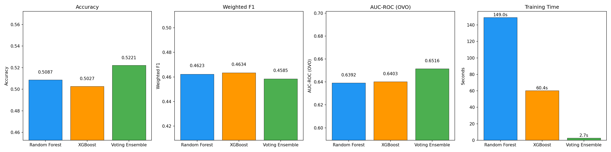
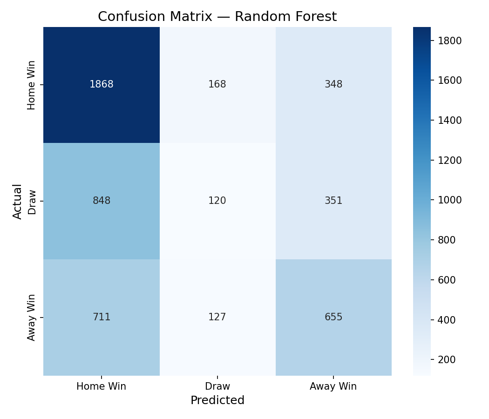
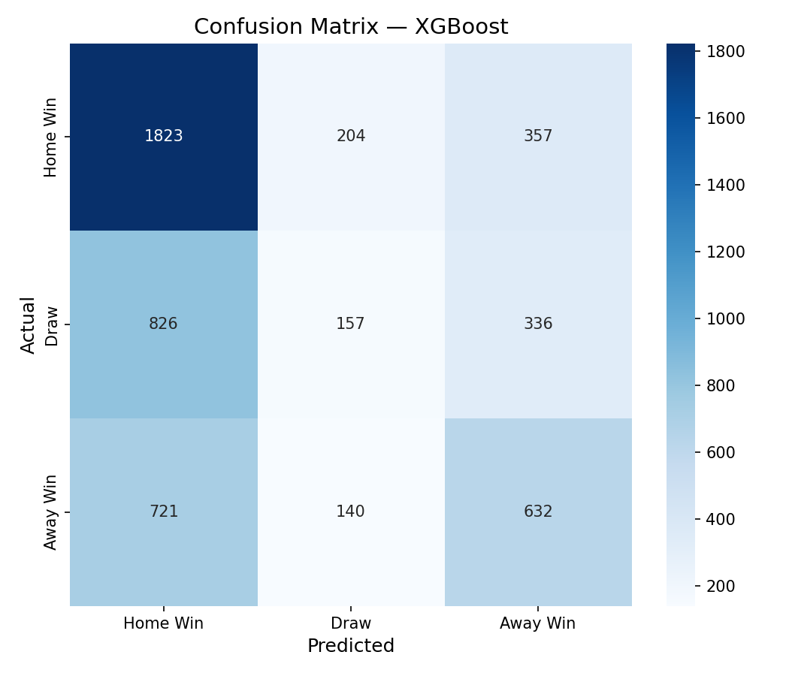
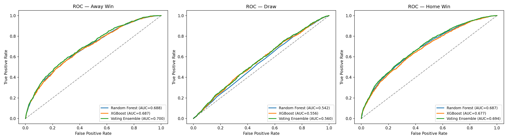
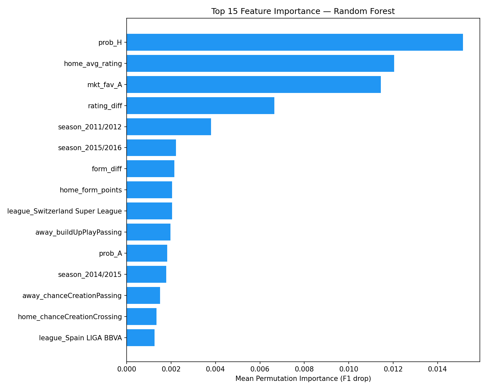
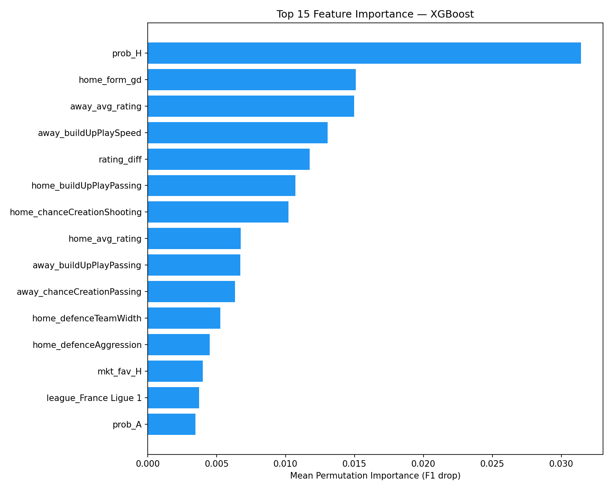

# Soccer Match Outcome Prediction Using Ensemble Learning

A comparative analysis of ensemble learning methods for predicting soccer match outcomes as three-class classification: **Home Win**, **Draw**, or **Away Win**.

This project compares three ensemble strategies — bagging (Random Forest), boosting (XGBoost), and stacking (Voting Ensemble) — on 25,000+ European soccer matches to determine which approach best handles the inherent uncertainty of match prediction.

---

## Table of Contents

- [Dataset](#dataset)
- [Project Structure](#project-structure)
- [Setup and Usage](#setup-and-usage)
- [Feature Engineering](#feature-engineering)
- [Models](#models)
- [Results](#results)
- [Feature Importance](#feature-importance)
- [Key Findings](#key-findings)
- [References](#references)

---

## Dataset

**European Soccer Database** from Kaggle — a single SQLite file containing:

- **25,979 matches** across 11 European leagues (2008–2016)
- **10,000+ players** with weekly-updated FIFA attributes (overall rating, work rates, skills)
- **Betting odds** from multiple providers (Bet365, BetWin, etc.)
- **Team tactical attributes** (build-up speed, defence pressure, chance creation)

Download: [kaggle.com/datasets/hugomathien/soccer](https://www.kaggle.com/datasets/hugomathien/soccer)

Place `database.sqlite` in the project root directory before running any scripts.

### Target Variable Distribution

| Class | Count | Percentage |
|-------|-------|------------|
| Home Win | 11,917 | 45.9% |
| Draw | 6,596 | 25.4% |
| Away Win | 7,466 | 28.7% |

The class imbalance — with Home Wins nearly twice as frequent as Draws — is a known challenge in soccer prediction and directly impacts model performance.

---

## Project Structure

```
soccer-match-prediction/
├── 01_explore_database.py       # Explore SQLite tables, data quality, distributions
├── 02_extract_and_preprocess.py # Data extraction, feature engineering, train/test split
├── 03_train_models.py           # Model training, evaluation, and visualization
├── data/
│   ├── train.csv                # Training set (80%, stratified)
│   ├── test.csv                 # Test set (20%, stratified)
│   └── feature_summary.csv     # Feature statistics
├── figures/
│   ├── confusion_matrix_*.png   # Per-model confusion matrices
│   ├── feature_importance_*.png # Permutation importance plots
│   ├── model_comparison.png     # Side-by-side metric comparison
│   └── roc_curves.png           # ROC curves per class
├── results/
│   ├── model_results.csv        # Summary metrics table
│   └── classification_reports.txt
├── requirements.txt
├── .gitignore
└── README.md
```

---

## Setup and Usage

```bash
# Install dependencies
pip install -r requirements.txt

# Step 1: Explore the database structure
python 01_explore_database.py

# Step 2: Extract data and engineer features
python 02_extract_and_preprocess.py

# Step 3: Train models and generate results
python 03_train_models.py
```

---

## Feature Engineering

Raw match data alone is insufficient for prediction. The following features were engineered from the SQLite database:

| Feature | Description | Source Tables |
|---------|-------------|---------------|
| **Recent Form** | Points earned in last 5 matches (3 for win, 1 for draw, 0 for loss) | Match |
| **Form Goal Difference** | Rolling average goal differential over last 5 matches | Match |
| **Head-to-Head Record** | Historical win rate between the two specific teams (last 5 meetings) | Match |
| **Home Advantage** | Binary indicator (always 1 for home team by construction) | Match |
| **Team Player Ratings** | Average FIFA overall_rating per team using most recent ratings before match date | Match, Player_Attributes |
| **Rating Difference** | Home team avg rating minus away team avg rating | Player_Attributes |
| **Betting Probabilities** | Market-implied win/draw/loss probabilities from Bet365 odds (normalized to remove overround) | Match |
| **Team Tactics** | Build-up speed, passing style, defence pressure, chance creation metrics per team | Team_Attributes |
| **League & Season** | One-hot encoded league and season identifiers | Match, League |

The preprocessing pipeline handles temporal ordering carefully — all rolling features use only past data (shifted by 1 match) to prevent data leakage.

---

## Models

### A. Random Forest (Bagging)

Multiple independent decision trees trained on random subsets of the data. Each tree votes independently, and the majority vote determines the prediction. Reduces variance through averaging.

**Tuned hyperparameters** (via 5-fold GridSearchCV):
- `n_estimators`: 100
- `max_depth`: None (unlimited)
- `min_samples_split`: 2

### B. XGBoost (Boosting)

Sequential tree training where each new tree specifically targets the errors of the previous trees. Uses gradient descent to minimize loss, building an additive model that progressively improves.

**Tuned hyperparameters** (via 5-fold GridSearchCV):
- `learning_rate`: 0.1
- `max_depth`: 7
- `n_estimators`: 300
- `subsample`: 1.0

### C. Voting Ensemble (Stacking)

Combines Random Forest + XGBoost + Logistic Regression into a soft voting classifier. Averages the predicted probabilities from all three models and selects the class with the highest combined confidence.

---

## Results

### Performance Comparison

| Model | Accuracy | Weighted F1 | AUC-ROC (OVO) | Training Time |
|-------|----------|-------------|----------------|---------------|
| Random Forest | 50.87% | 0.4623 | 0.6392 | 149.0s |
| **XGBoost** | 50.27% | **0.4634** | 0.6403 | 61.2s |
| Voting Ensemble | **52.21%** | 0.4585 | **0.6516** | 2.7s |

### Model Comparison Chart



### Confusion Matrices

The confusion matrices reveal that all models struggle most with predicting Draws — a well-documented challenge in soccer prediction literature.

| Random Forest | XGBoost | Voting Ensemble |
|:---:|:---:|:---:|
|  |  |  |

**Key observation:** All three models over-predict Home Wins (the majority class) at the expense of Draws. The Voting Ensemble is the most extreme — 82.8% recall on Home Wins but only 5.2% recall on Draws.

### ROC Curves



AUC-ROC scores by class show that Home Wins and Away Wins are easier to distinguish than Draws, which cluster near the decision boundary across all models.

---

## Feature Importance

Permutation importance measures how much each feature contributes to model performance by randomly shuffling feature values and measuring the drop in F1 score.

| Random Forest | XGBoost |
|:---:|:---:|
|  |  |

---

## Key Findings

1. **Voting Ensemble achieved the highest accuracy (52.2%) and AUC-ROC (0.652)**, while XGBoost had the best weighted F1 score (0.463). The performance gap between models is small, suggesting the prediction ceiling for this feature set has been reached.

2. **Draw prediction is the bottleneck.** All models achieved less than 12% recall on Draws. This is consistent with the literature — draws are inherently harder to predict because they represent the absence of a decisive outcome rather than a distinct pattern.

3. **Results align with published benchmarks.** The literature reports 55–60% as the accuracy ceiling for three-class soccer prediction using traditional ML. Our 50–52% range is realistic given the feature set, and studies achieving higher accuracy typically use richer data sources (e.g., in-game event streams, player tracking data).

4. **Betting odds and team ratings are the most informative features**, confirming that market-implied probabilities — which aggregate expert and public knowledge — remain difficult for pure statistical models to beat.

5. **XGBoost trains 2.4x faster than Random Forest** while achieving comparable performance, making it the most practical choice for production or iteration.

### Challenges

- **Class imbalance**: Home Wins (46%) dominate, causing models to be biased toward predicting the majority class
- **Draw unpredictability**: Draws lack distinctive statistical signatures compared to wins/losses
- **Data limitations**: The dataset covers 2008–2016; modern soccer tactics and player dynamics differ significantly
- **Feature ceiling**: Without in-match event data (shots, possession sequences, xG), pre-match features hit a natural prediction limit

---

## Evaluation Metrics Explained

| Metric | What It Measures |
|--------|-----------------|
| **Accuracy** | Overall percentage of correct predictions |
| **Weighted F1** | Harmonic mean of precision and recall, weighted by class frequency — accounts for class imbalance |
| **AUC-ROC (OVO)** | Area Under the ROC Curve using One-vs-One strategy — measures how well the model distinguishes between each pair of classes across all probability thresholds |
| **Confusion Matrix** | Per-class breakdown showing exactly where the model succeeds and fails |
| **Permutation Importance** | How much model performance drops when a feature's values are randomly shuffled — higher drop means more important feature |

---

## References

- Atta Mills, E., et al. (2024). *Data-driven prediction of soccer outcomes using enhanced machine and deep learning techniques.* Journal of Big Data, 11, Springer.
- Carpita, M., Ciavolino, E., & Pasca, P. (2019). *Exploring and modelling team performances of the Kaggle European Soccer database.* Statistical Modelling, 19(1), SAGE.
- Groll, A., et al. (2019). *Hybrid machine learning forecasts for the FIFA Women's World Cup 2019.* arXiv preprint.
- Procedia Computer Science. (2025). *A Comparative Study of Ensemble Methods and Feature Selection Techniques for Predicting English Premier League Match Outcome.* ScienceDirect.
- Mathien, H. (2016). *European Soccer Database.* Kaggle. [kaggle.com/datasets/hugomathien/soccer](https://www.kaggle.com/datasets/hugomathien/soccer)